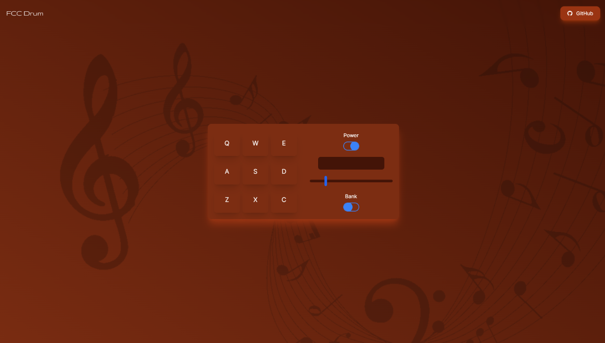

# FCC Drum

Welcome to FCC Drum, a virtual drum machine that lets you create beats and rhythms using your keyboard or mouse. Unlock your musical creativity and compose unique percussion tracks with ease.

## Features

- Play different drum sounds using keyboard keys or mouse clicks.
- Experience real-time drum sound playback.
- Create your own rhythms and beats.
- Express your musical ideas and creativity.
- Cross-device compatibility for both desktop and mobile.

## Getting Started

To start using FCC Drum, simply follow these steps:

1. Clone this repository to your local machine.
2. Install dependency using `npm install`.
3. Run the development server using `npm run dev`.
4. Open your browser and navigate to the provided URL (usually `http://localhost:3000`).
5. Start creating your beats and rhythms using the keyboard or mouse!

## Keyboard Controls

- Press the keys "q", "w", "e", "a", "s", "d", "z", "x", and "c" to play different drum sounds.
- Toggle the power button to enable/disable the drum machine.
- Switch between different drum kits using the "Bank" button.
- Adjust the volume using the volume slider.

## Technologies Used

- NextJs 13
- HTML5 Audio API

## Contributing

Contributions are welcome! If you find any bugs or have ideas for improvements, feel free to open an issue or submit a pull request.

## Credits

- This project was created by [Baliram Singh](https://ome9a.com).
- Drum sound samples are provided by [FreeCodeCamp](https://www.freecodecamp.org).

## License

This project is licensed under the [MIT License](LICENSE).
